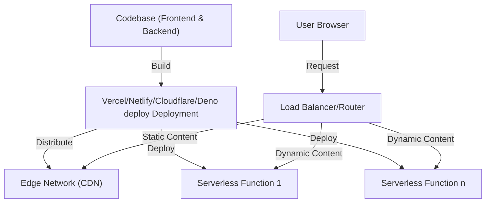

# DSCO Deep Dive 2023-06-14

Possible topics

- What is epicenter
- What is a monorepo?
- What is an API?
- What is a modern full stack web app?
- How's epicenter deployed
  - Provisioning lifecycle(s)
  - Right tool for the right job
- UX design to DX Design

### Modern Stack Parts

### Modern stack deployment

