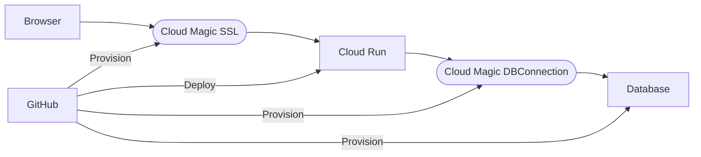

import Image from "next/image";

# DSCO Deep Dive 2023-06-14

Possible topics

- What is epicenter
- What is a monorepo?
- What is an API?
- What is a modern full stack web app?
- How's epicenter deployed
  - Provisioning lifecycle(s)
  - Right tool for the right job
- UX design to DX Design

## Stack Parts

### Our Stack

### Lighthouse Scores

<Image
  className="nx-mt-2"
  src="/images/Epi-Lighthouse-Score-100.png"
  alt="Epicenter Lighthouse Score"
  width={368}
  height={169}
/>

### Modern stack deployment

High-Performance Developer-Centric Cloud Platforms
such as Vercel, Netlify, Cloudflare, Deno Deploy

